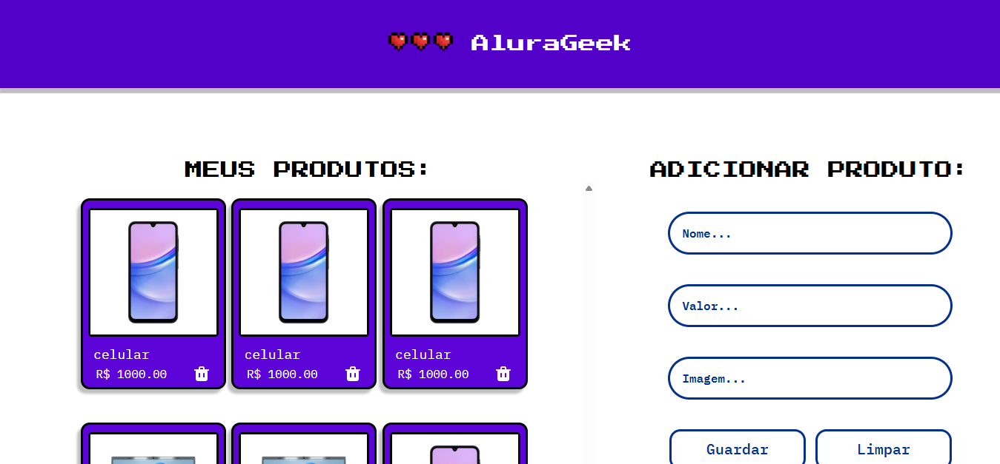

# 🛍️ AluraGeek

Um catálogo de produtos onde você pode **adicionar**, **listar** e **remover produtos**.  
Desenvolvido com **TypeScript**, **Vite**, **Tailwind CSS** e manipulação direta do **DOM**.

---

## 📸 Pré-visualização


---

## 🚀 Funcionalidades
- ✅ Adicionar novos produtos com **nome**, **valor** e **imagem**.
- ✅ Exibir lista de produtos cadastrados.
- ✅ Remover produtos da lista.
- ✅ Salvar dados no **LocalStorage** (persistência após atualizar a página).
- ✅ Layout responsivo com **Tailwind CSS**.

---

## 🛠️ Tecnologias Utilizadas
- **TypeScript**
- **HTML5**
- **Tailwind CSS**
- **LocalStorage API**

---

## ▶️ Como Executar o Projeto Localmente

### 1️⃣ Clone o repositório
```
git clone https://github.com/seu-usuario/aluraGeek.git
cd aluraGeek
```

### 2️⃣ Instale as dependências
```
npm install
```

### 3️⃣ Inicie o servidor de desenvolvimento
```
npm run dev
```

## 🔨 Build para Produção
npm run build

## Para testar localmente o build:
```
npm run preview
```

